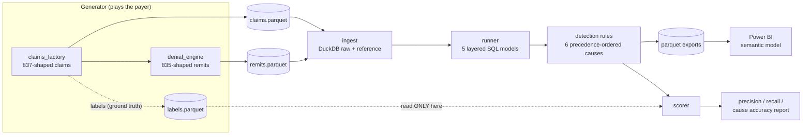
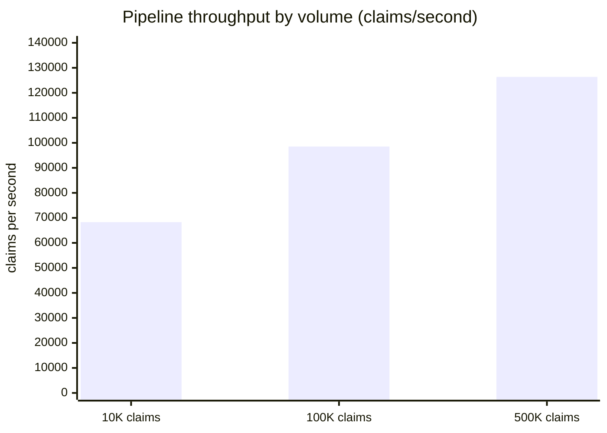

# claims-denial-leakage-miner

**A revenue leakage analyzer that mines 837/835-shaped hospital claims for preventable denials and attributes each one to an actionable root cause, with 99.5% precision and 100% recall measured against labeled ground truth.**


## What this solves

- Denied claims hide preventable revenue loss: this tool classifies each denied claim into one of six preventable root causes and quantifies the dollars, flagging $5.57M of $7.28M denied dollars as preventable in the included 10K-claim dataset.
- Remit codes lie: 20% of denials in the dataset carry a generic CARC 16, so the rules anchor on claim attributes first and use CARC codes only as corroboration, keeping root cause attribution at 99.1%.
- Denial reports without evidence are opinions: a labeled synthetic claims generator provides ground truth, so precision, recall, and cause accuracy are measured numbers, not aspirations.

## Executive summary

Hospital billing teams work denials one claim at a time, but the money is lost in patterns: an auth-required imaging department submitting without authorization numbers, a payer with a 90-day filing limit paired with a slow coding queue, resubmissions that duplicate in-flight claims. In the representative 10K-claim dataset generated by this project ($51.2M billed, a 15.7% denial rate consistent with industry ranges), $7.28M in claims were denied and $5.57M of that traces to six preventable causes.

The miner is a batch analytics pipeline. A generator produces 837-shaped claims and 835-shaped remittances with a known share of injected, labeled billing errors. The pipeline lands both files in DuckDB, builds five layered SQL models (staging, denial and leakage facts, a monthly KPI mart), and a rule engine classifies each denied claim by attribute evidence: submission lag versus the payer filing limit, authorization presence in auth-required departments, diagnosis validity for the procedure, attribute-identical duplicate groups, coverage windows, and modifier requirements. Results export to parquet for a Power BI revenue cycle command center.

Because the generator writes ground-truth labels to a file the detector never reads, the detector's quality is measurable: across 10K, 100K, and 500K claim volumes it holds 99.5% precision, 100% recall, 99.1% correct root cause attribution, and 100% dollar recall, processing 126K claims/second at the 500K scale on a 1 vCPU container (see Performance under load).

## Architecture



Failure boundaries: ingest validates file presence and fails fast with the exact command to fix; models run in declared dependency order so a failed model stops downstream builds; the scorer is the only component allowed to touch labels, enforced by a test.

## Tech stack

| Technology | Role in this project | Why chosen here |
|---|---|---|
| Python 3.11+ | Generator, orchestration, CLI | Right tool for tabular synthesis; matches the pandas/numpy layer |
| DuckDB | Analytics warehouse | Scan-heavy batch SQL with zero infra; see ADR-0001 |
| Plain .sql model files | Staging, facts, KPI mart | Reviewable, diffable, portable to MS SQL Server or Snowflake |
| Rule engine in SQL | Denial root cause classification | Auditable sentences over feature importances; see ADR-0002 |
| Power BI (spec + DAX) | Revenue cycle command center | Semantic model and measures in `powerbi/`; parquet feed exported by the pipeline |
| pytest + pytest-cov | 23 tests, 96% measured coverage | Invariant tests guard label isolation and dollar reconciliation |
| ruff + GitHub Actions | Lint and CI on 3.11/3.12 | Coverage floor enforced at 90% in CI |

## Quickstart

Prerequisites: Python 3.11+, pip.

```bash
git clone https://github.com/ManojKumarChunduru/claims-denial-leakage-miner.git
cd claims-denial-leakage-miner
pip install -e ".[dev]"
claims-miner all        # generate -> ingest -> models -> detect -> export -> score
pytest                  # 23 tests
```

`claims-miner all` prints the detection scorecard as JSON and writes the Power BI feed to `powerbi/export/`. Volumes and rates are configured in `config/settings.yaml` or via env vars (`CLAIMS_MINER__GENERATOR__N_CLAIMS=500000`).

Optional Postgres endpoint (for a Power BI gateway or SSRS): `docker compose up -d && python scripts/load_postgres.py`.

## Performance under load

Methodology: `python benchmark/run_benchmark.py` runs the full pipeline at 10K, 100K, and 500K claims in isolated temp warehouses. Container: 1 vCPU, 3.9 GB RAM, Linux, Python 3.12, DuckDB 1.5.4. Throughput covers ingest + models + detection (generation excluded: production claims arrive from the billing system). Raw output with machine context: `benchmark/results/`.



| Claims | Pipeline seconds | Claims/s | Precision | Recall | Cause accuracy |
|-------:|-----------------:|---------:|----------:|-------:|---------------:|
| 10,000 | 0.146 | 68,287 | 0.9959 | 1.0000 | 0.9908 |
| 100,000 | 1.015 | 98,515 | 0.9952 | 1.0000 | 0.9918 |
| 500,000 | 3.957 | 126,369 | 0.9945 | 1.0000 | 0.9922 |

Throughput rises with volume because DuckDB's columnar engine amortizes fixed costs; the knee will arrive when the working set outgrows RAM (well beyond 500K claims at this schema width on this container). The honest slow spot is the generator itself: error injection is a row-wise Python loop and takes 157 seconds at 500K claims. It is excluded from pipeline throughput for the reason above, and vectorizing it is listed under Future work.

A note on recall: 100% is real but partly a property of the synthetic world, where every injected error leaves a clean attribute trace and payers reliably code duplicates as CARC 18. Real-world recall would be lower because real errors are messier; the precision and cause accuracy figures are the better predictors of field behavior.

## Architecture decisions

Two ADRs in [`docs/adr/`](docs/adr/):

- [ADR-0001](docs/adr/0001-duckdb-over-postgres.md): DuckDB over PostgreSQL for the analytics warehouse (the boring choice: zero ops, columnar fit, portable SQL; Postgres kept as an optional served endpoint).
- [ADR-0002](docs/adr/0002-rules-over-ml.md): deterministic rules over ML for denial classification (auditable sentences, day-one operation, and a stated trigger for adding a model later).

## Intentionally out of scope

No real-time or streaming ingestion. Remittance files arrive from payers in daily batches, so batch is the honest cadence. Trigger for revisiting: a requirement to surface denial feedback to charge-entry staff intra-day, at which point the ingest boundary becomes a file-watcher or queue consumer without touching the SQL models.

## Security and compliance

- Every row is synthetic. No PHI, no real patient, provider, or payer data exists anywhere in this repository, which is what makes a public healthcare billing portfolio project possible at all.
- Secrets: the only credential is the optional local Postgres password, supplied via environment variables with local-only defaults; production paths would use a managed secret store.
- Nothing sensitive is logged: log lines carry counts, dollars, table names, and timings, never row-level claim content.
- The generator's realism is bounded on purpose: CARC codes and code sets are public X12/AMA vocabulary, and amounts are drawn from configured ranges, not sampled from any real dataset.

## Failure modes

| Failure | Detection | Behavior | Recovery |
|---|---|---|---|
| Input parquet missing | Ingest checks file existence | Fails fast, names the missing file and the exact command to produce it | Run `claims-miner generate` |
| SQL model error | Runner executes models in declared order | Pipeline stops at the failed model; downstream models never build against stale inputs | Fix the model, re-run `claims-miner run` (models are CREATE OR REPLACE, idempotent) |
| Warehouse file corrupted or locked | DuckDB connection error at ingest | Run aborts before any writes | Delete `data/*.duckdb*` and re-run; raw parquet files are the source of truth |
| Labels file absent at scoring | Scorer reads it explicitly | `score` fails with the path; `run` is unaffected since detection never needs labels | Re-run `claims-miner generate` |
| Postgres export target down | duckdb postgres ATTACH fails in the loader | Loader exits nonzero; the core pipeline and parquet exports are unaffected | `docker compose up -d`, re-run the loader |

## Hardest problem solved

The scorer reports cause accuracy: of the claims correctly flagged as preventable, how many were attributed to the correct root cause. On the first complete run it was stuck at 0.84 while precision and recall looked excellent, which made no sense for attribute-anchored rules.

Grouping the mismatches by injected versus detected cause showed one cell carrying almost all of it: 182 claims injected with `missing_modifier` but detected as `invalid_dx_pair`. The injection code forced those claims onto CPT 27447 (knee arthroplasty, a modifier-required procedure) and blanked the modifier, but kept the claim's original diagnosis, which is almost never valid for an arthroplasty. Each of those claims therefore carried two real errors while the label admitted only one, and the diagnosis rule outranks the modifier rule in precedence, so the detector answered correctly about a claim the generator had described wrongly.

The fix re-draws the diagnosis from the new procedure's valid set at injection time, so the claim carries exactly the error its label claims (commit `ce7f7d0`, regression-tested in `tests/test_generator.py::test_missing_modifier_injection_keeps_dx_valid`). Cause accuracy moved to 0.991; the remaining <1% are claims that genuinely carry two defensible causes. The lesson generalizes: when a detector and its ground truth disagree, audit the ground truth before the detector.

## Future work

- Vectorize the error injection loop; at 500K claims it is 40x slower than the entire pipeline it feeds.
- Add an unclassified-denials report (fct_denials minus detected_leakage) as the worklist for expanding rule coverage, and as the training set if the ADR-0002 hybrid trigger fires.
- Port the SQL models to MS SQL Server syntax behind a dialect flag, matching the warehouse most hospital reporting teams actually run.
- Add a monthly trend test: alert when preventable dollars grow faster than billed dollars for two consecutive months.
- First metric to watch in production: unclassified share of denied dollars, the direct measure of rule coverage decay.

## License

MIT
